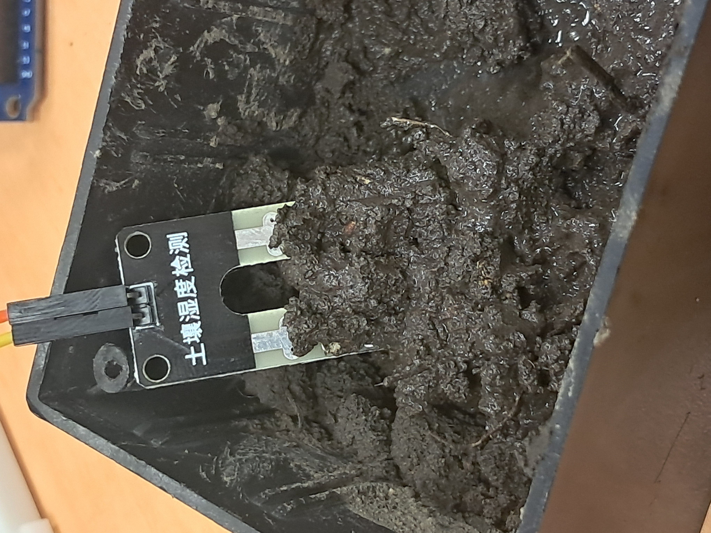

# Mini Projet -- 21/11/2024 
## Capteur humidité du sol avec capteur d'humidité et température de l'air.

#### Ce repository contient le code et les fichiers nécessaire pour pouvoir faire fonctionner le capteur de température et d'humidité DHT11 et d'un capteur d'humidité du sol tout en enregistrant les données sur une carte SD.

#### Le projet à été coder sur l'IDE Visual Studio Code 1.95.3

## Où retrouver le code ?

#### Le code arduino en lui même ce trouve dans le dossier src et c'est le fichier main.cpp qui contient le code.

#### Si vous voulez refaire le projet la liste des matériels et les branchement sont indiqué ci-dessous : 

## Matériels :
#### 1. Capteur DHT11
#### 2. Capteur du sol "MH-Sensor-Series"
#### 3. Module MH-SD Card Module
#### 4. Arduino Mega 2560

## Connexions des composants

| Composant          | Broche Arduino | Broche Composant        | Description                                   |
|---------------------|----------------|--------------------------|-----------------------------------------------|
| Carte SD            | 3.3V           | 3.3V                    | Alimentation pour le module SD               |
| Carte SD            | 53             | CS                      | Chip Select (SPI)                            |
| Carte SD            | 52             | SCK                     | Serial Clock (SPI)                           |
| Carte SD            | 50             | MISO                    | Master In Slave Out (SPI)                    |
| Carte SD            | 51             | MOSI                    | Master Out Slave In (SPI)                    |
| DHT11               | 5V             | 5V                      | Alimentation pour le capteur DHT11           |
| DHT11               | 3              | Data                    | Broche Data du capteur DHT11                 |
| MH Sensor Series    | 5V             | 5V                      | Alimentation pour le capteur d'humidité du sol |
| MH Sensor Series    | A0             | A0                      | Lecture analogique de l'humidité du sol      |

